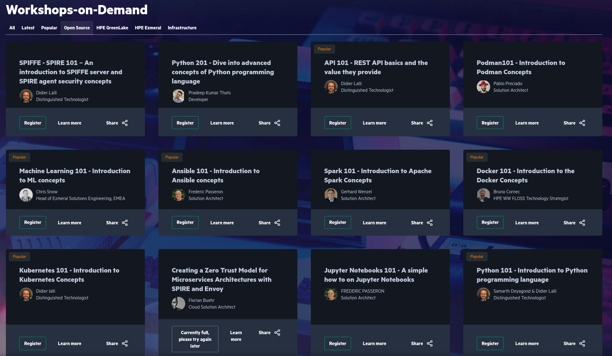
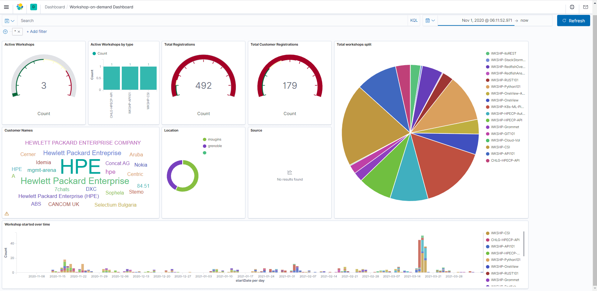
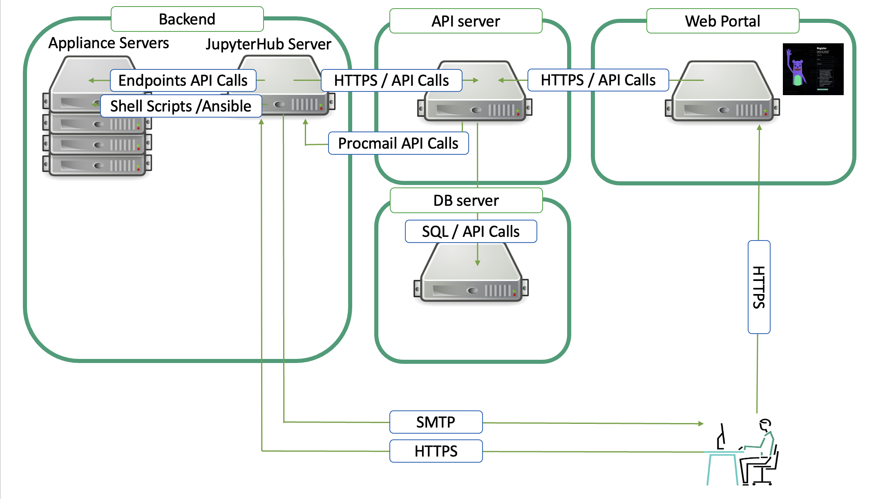
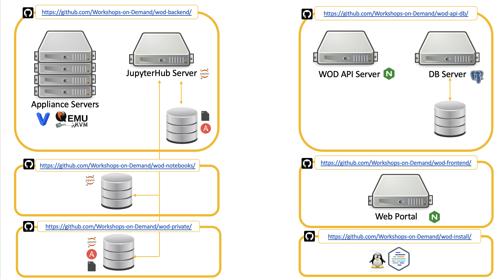
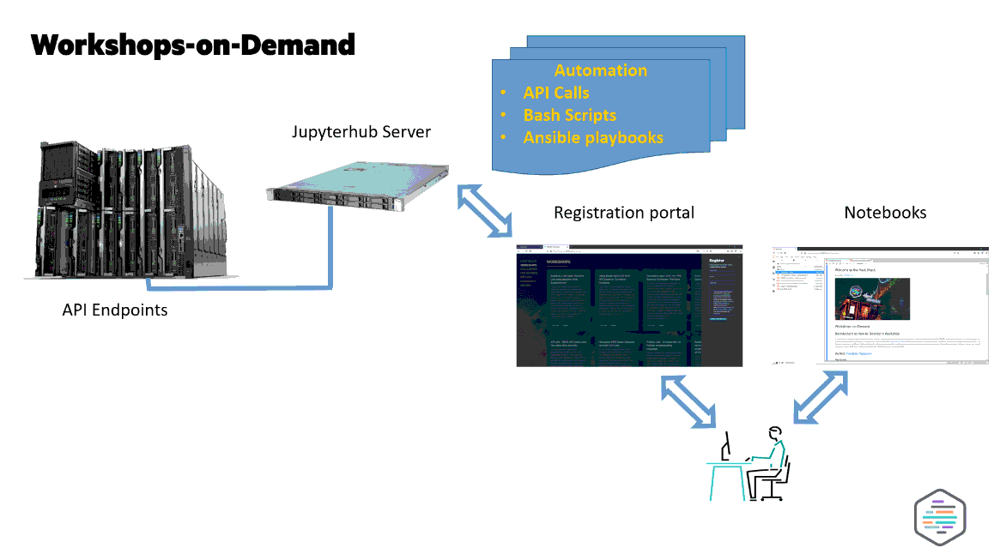

Leveraging the JupyterHub technology, the HPE DEV team, at the origin of the project, created a set of hands-on technology training workshops where anyone could connect to our service and benefit from notebook-based workshops at any time, and from anywhere. Read our [User's Guide](USER-GUIDE.md) to see it in action.

Now, let me explain how we made this possible…

## Where it all comes from

We built up our first JupyterHub server for the virtual HPE Technology & Solutions Summit (TSS) that took place in March 2020 and used it to deliver the workshops we would normally give in person in a virtual way. We hosted just a few Jupyter notebooks-based workshops and found that they scored really well in feedback we received from the students. All notebooks were delivered through a single instance of a JupyterHub server.

During the event, we ran only a single workshop at a time. We first set up a range of users (students) to match a given workshop. It required a lot of manual setup, a few scripts and a single Ansible playbook to handle the copy of the workshop content assigned to the desired range of students, with a few variable substitutions like student IDs, passwords, and some API endpoints when relevant. The student assignment was done manually, at the beginning of every workshop. For instance, Fred was student1, Didier was student2, and so on… which was quite cumbersome. When you only have a range of 25 students, one or two people handling the back end is sufficient. But if 40 people show up, then it becomes tricky.

This initial work lead us the the following results collected in our dashboard presenting:
-    The number of Active Workshops
-    The active workshops by type
-    The total number of registrations from November 1st 2020 till today
-    The total number of Customer (student) registrations
-    The total workshops split

As you can see, moving from a heavily manually oriented approach to now a fully automated one helped increase our numbers.

Of course, as automation minded people, we could not stay like that for long, so we decided to build a framework to help us deliver more Workshops on Demand (aka WoD) and began our 5 years journey of developing it till version 1.0.0 :-)

## Architecture considerations

Soon we realized that for the project to be usable, we would need to improve various aspects. Our needs were the follwing:
- provide a registration portal to allow workshop exposure and automated user registration. 
- automate fully all the tasks on the platform (deployment of the notebook, once chosen on that portal, cleanup, security, ...)
- keep track of the association made between users and students, the workshop chosen, 
- manage workshops (capacity, reset specificities, ...)
- add easily more content to the platform, developed by contributors
- manage a private set of data (content, parameters, scripts) in addition to the public one provided
- support mulitple locations for redundancy, technology specificities
- operate multiple platforms (dev, staging, production, ...)
- operate as well on VMs or physical servers
- deploying the platform from zero to ready to operate fully automated

As you can see, we have a few environments to deploy and manage. The various aspects were coded during 5 years to reach the desired state expressed upper. Without automation, it would have been too much work and prone to error. That was a key aspect of our approach.

We quickly chose the various tools that will help us manage this efficiently:
- Linux for the OS ([Ubuntu LTS](https://ubuntu.com/download/server) being the primary distribution, CentOS/[Rocky Linux](https://rockylinux.org/download) the alternative for backend)
- [Ansible](https://en.wikipedia.org/wiki/Ansible_(software)) for automation and conformity management
- [YAML](https://en.wikipedia.org/wiki/YAML) for configuration files (wod.yml, ansible playbooks and variables)
- [Git](https://en.wikipedia.org/wiki/Git) as a configuration management system storing all our files and [GitHub](https://github.com/Workshops-on-Demand) for publication 
- [PostgreSQL](https://en.wikipedia.org/wiki/PostgreSQL) to store permanently some information around users, workshops, students, ...
- [Javascript](https://en.wikipedia.org/wiki/JavaScript), [NodeJS](https://en.wikipedia.org/wiki/Node.js), [React](https://en.wikipedia.org/wiki/React_(software)), [Grommet](https://v2.grommet.io/) for the frontend and API servers
- [REST](https://en.wikipedia.org/wiki/REST) API (The one from JupyterHub, and one we created for our project)
- [SMTP](https://en.wikipedia.org/wiki/Simple_Mail_Transfer_Protocol) API using [procmail](https://en.wikipedia.org/wiki/Procmail) for our incoming communication with the backend

From an architecture perspective, we rapidly agreed that we would need multiple machines/services:

- A frontend server to manage he workshop list and allow user registration
- An API server coupled with the Database to orchestrate the platform
- A backend server on which will run the JupyterHub service and where the Notebooks will be deployed
- Appliances servers running the technology at work in the Notebook (optional)

For our automation, we have playbooks that would perform:
- Server configuration (based on an existing deployed Operating System with just git installed) including:
    - Repository Update
    - Apps Installation
    - System Performance Tuning including kernels setup & configuration 
    and depending on the server:
    - on backend:
        - JupyterHub application installation and configuration
        - Linux students creation
        - JupyterHub users creation
    - on frontend:
         - Javascript setup with npm
         - portal installation and launch
    - on the API/DB:
         - Javascript setup with npm
         - PostgreSQL install and setup with sequelize
         - REST API server installation and launch
- Server conformity management (run after the previous playbook and on demand and nightly to ensure that the configuration is consistent and up to date):
    - System Update
    - Security Setup
    - Services Conformity and check
    - Templating of configration and data files
- Notebooks deployment on the JupyterHub server:
    - Templating the Notebook and data files
    - Security setup

We created as many Git repositories as needed, for the infrastructure management:

- [wod-frontend](https://github.com/Workshops-on-Demand/wod-frontend) for the portal
- [wod-api-db](https://github.com/Workshops-on-Demand/wod-api-db) for the REST API and PostgreSQL DB
- [wod-backend](https://github.com/Workshops-on-Demand/wod-backend) for the JupyterHub
- [wod-notebooks](https://github.com/Workshops-on-Demand/wod-notebooks) for the Notebooks provided
- [wod-private](https://github.com/Workshops-on-Demand/wod-private) as a template fo using a private setup alongside the public one.
- [wod-install](https://github.com/Workshops-on-Demand/wod-install) for the installation of the infrastructure
- [wod-doc](https://github.com/Workshops-on-Demand/.github) for the project documentation (you're on it !)

## How it works

Let me first show you how the overall process works for our Workshops-on-Demand:

If you’re looking for a live explanation of this automation, you can review [the following session](https://www.youtube.com/watch?v=D6Ss3T2p008&t=515s) delivered at Linuxconf in Australia in January 2021. If you prefer reading, consider our [User's Guide](USER-GUIDE.md)

**Step 1:** The customer registers for a workshop online at our portal. When clicking the register button for the selected workshop and after agreeing to the terms and conditions, the frontend triggers the first REST API calls to the API-DB server:
-    Register the student in the Customers Database.
-    Send a welcome email to the student.
-    Assign a student ID to him/her according to the student range allocated to the given workshop.

**Step 2:** The API-DB server then orders (through a mail API call managed by procmail) the backend to:
-    Generate a random password for the selected student
-    Deploy the selected workshop

**Step 3:** The backend server calls back the API-DB server using its REST API to:
-    Provide back the new student password
-    Make the student’s database record active
-    Decrement Workshop capacity

**Step 4:** The API-DB server sends:
-    The credentials email to allow the student to connect to the workshop

This infrastructure automation relies mainly on a few bash scripts and Ansible playbooks to: 
-    Generate random passwords
-    Update LDAP passwords accordingly when required
-    Deploy the given workshop to the proper student home directory through an Ansible playbook
-    Update the notebook content through Ansible variables substitutions
     -    Student ID
     -    Student password
     -    API Endpoints definition
-    Update student permissions
-    Perform all necessary create or reset actions linked to a given workshop outside of the notebook customization

The API-DB server actually sends an email to the backend with a dedicated format (an API!) that is then parsed by the Procmail process to retrieve the necessary information to perform the different tasks. We use 4 verbs: CREATE (to setup to the student environment as described upper), DELETE (to remove the user from tables), RESET (to clean up the student content and reset the back-end infrastructure when needed) and PURGE (globally DELETE+RESET aka full cleanup)

At the end of this automated process, the backend makes a series of API calls to the API-DB server to send back the required information, like a new password, workshop status, etc.

# A bit of background

[The Workshops-on-Demand program ](https://developer.hpe.com/hackshack/workshops/) has been an important asset for the HPE Developer Community for the last 2 years. If you are interested in learning more on the genesis of the project, check the following [blog](https://developer.hpe.com/blog/from-jupyter-notebooks-as-a-service-to-hpe-dev-workshops-on-demand/).

This program allows us to deliver free hands-on workshops. We use these during HPE sponsored events, like HPE Discover and HPE Technical Symposium Summit, as well as open source events, like  Open Source Summit and KubeCon, to promote API/automation-driven solutions along with some 101-level coding courses. By the end of 2022, more than 4000  had registered for our workshops.

If you are interested in creating your own training architecture to deliver workshops, this project is definitely for you. It would allow you to create, manage content and deliver it in an automated and very efficient way. Once ready, the infrastructure can deliver workshops in matter of minutes!

Trying to build a similar architecture on your own is obviously possible, but we integrated so much automation around the different components like the JupyterHub server deployment along with multiple pre installed kernels, user management and much more. When leveraging our project, one can actually get a proper public-based environment in 2 hours.

This very first article will set the stage for the following blog articles where I will explain how to setup your own Workshops-on-Demand infrastructure. 

## Why would we consider open sourcing our Workshops-on-Demand?

Firstly, if you read carefully the messaging on our [homepage](https://developer.hpe.com/) , you will find words like sharing and collaborating. This is part of the HPE Developer team's DNA. 

Secondly, the project is based on open source technologies like Jupyter and Ansible. It felt natural that the work we did leveraging these should also benefit the open source community.

We have, actually, shared the fundamentals of the project thoughout the HPE Developer Community, and to a wider extent, the Open Source Community  through different internal and external events. And the feedback has always been positive. Some people found the project very appealing. Originally, and long before even thinking of open sourcing the project, when we really started the project development, people were mainly interested in the content and not necessarily in the infrastructure. The students wanted to be able to reuse some of the notebooks. And in a few cases, they also asked for details about the infrastructure itself, asking about the notebooks delivery mechanism and other subjects like the [procmail API](https://www.youtube.com/watch?v=zZm6ObQATDI).

Early last year, we were contacted by an HPE colleague who was willing to replicate our setup in order to deliver notebooks to its AI/ML engineers. His aim was to provide a simple, central point from which he could deliver Jupyter Notebooks, that would later be published on the Workshops-on-Demand infrastructure frontend portal, allowing content to be reused and shared amongst engineers. While, over time, we had worked  a lot on automating content delivery and some parts of the infrastructure setup, we needed now to rework and package the overall solution to make it completely open source and reusable by others.

As a result of our work on that project, over the course of 2022 we started to open source the Workshops-on-Demand program. As a project developed within the confiines of Hewlett Packard Enterprise (HPE), we had a number of technical, branding, and legal hurdles we needed to overcome in order to achieve this.

#### Legal side of things

From a legal standpoint, we needed to go through the HPE OSRB (Open Source Review Board) to present the project that we wanted to open source. We were asked to follow a process that consisted of four steps:

As the project did not contain any HPE proprietary software, as it is based on open source technologies like Ansible and Jupyter, the process was quite straightforward. Besides, HPE did not want to exploit commercially the generated intellectual property.  We explained to the OSRB that the new architecture of the solution would allow the administrator of the project to separate public content from private content, with private content being a proprietary technology.

This had a huge influence on the future architecture of the project that originally did not allow it. In our case, for instance, any workshop related to an HPE technology like  HPE Ezmeral, would fall into the private part of the project, and therefore, would not appear on the public github repository that we had to create for the overall project distribution.

#### Technical side of things

From a technical standpoint, as mentioned above, we had to make sure to separate the public only content from any possible private content. We started by sorting the different workshops (public vs private based). We also had to sort the related scripts that come along with the workshops. Going through this process, we found out that some of the global scripts had to be reworked as well to support any future split of public and private content. Similarly, we had to address any brand specifics, parameterizing instead of hardcoding variables as it was in the first version.

This took us a few months and we are now ready to share with you the result of this work. In this first blog, I will focus on the architecture side of the Workshops-on-Demand project. 

Further blog articles will help you setup your own architecture.

## The How

## Understand the architecture first

 The Workshops-on-Demand concept is fairly simple. The following picture gives you a general idea of how the process works.

Now that you understand the basic principle, let's look at the details. The image below shows what happens at each stage from a protocol standpoint.

### The Register Phase

**1.** Participants start by browsing a frontend web server that presents the catalog of available workshops. They then select one and register for it by entering their email address, first and last names, as well as their company name. Finally, they accept the terms and conditions and hit the register button. 

As the register button is clicked, the frontend server performs a series of actions.

**2.** Assigns a student (i.e student401) from the dedicated workshop range to the participant. Every workshop has a dedicated range of students assigned to it.

Here is a screenshot of the workshop table present in the frontend database server showing API 101 workshops details.

* Frederic Passeron gets assigned a studentid "student397" for workshop "API101".

  Here are the details of the participant info when registered to a given workshop.

**3.** An initial email is sent to participants from the frontend server welcoming them to the workshop and informing them that the deployment is ongoing and that a second email will arrive shortly providing the necessary information required to log onto the workshop environment.

**4.** At the same time, the frontend server sends the necessary orders through a procmail API call to the backend server. The mail sent to the backend server contains the following details:

* Action Type ( CREATE, CLEANUP, RESET)
* Workshop ID
* Student ID

**5.** The backend server recieves the order and processes it by parsing the email recieved using the procmail API. the procmail API automates the management of the workshops.

Like any API, it uses verbs to perform tasks.

* CREATE to deploy a workshop
* CLEANUP to delete a workshop
* RESET to reset associated workshop's resource

**CREATE subtasks:**

* **6.** It prepares any infrastructure that might be required for the workshop (Virtual Appliance, Virtual Machine, Docker Container, LDAP config, etc.).
* It generates a random Password for the allocated student.
* It deploys the workshop content on the jupyterhub server in the dedicated student home directory (Notebooks files necessary for the workshops).
* **7.** It sends back the confirmation of the deployment of the workshop, along with the student's required details (i.e password), through API Calls to the frontend server.

**8.** The frontend server tables will be updated in the following manner:

* The customers table shows an active status for the participant row. The password field has been updated.
* The workshop table also gets updated. The capacity field decrements the number of available seats.
* The student tables gets updated as well by setting the allocated student to active

**9.** The frontend server sends the second email to each participant providing them with the details to connect to the workshop environment.

### The Run Phase

**10.** From the email, the particpant clicks on the start button. it will open up a browser to the JupyterHub server and directly open the readme first notebook, presenting the workshop's flow.

Participants will go through the different steps and labs of the workshop connecting to the necessary endpoints and leveraging the different kernels available on the JupyterHub server.

Meanwhile, the frontend server will perform regular checks on how much time has passed. Depending on the time allocation (from 2 to 4 hours) associated with the workshop, the frontend server will send a reminder email usually a hour before the end of the time allocated. The time count actually starts when participants hit the register for the workshop button. It is mentioned in the terms and conditions.

Finally, when the time is up, the frontend server sends a new order to the backend to perform either CLEANUP or RESET action for the dedicated studentid.

**RESET subtasks:**

* It resets any infrastructure that was required for the workshop (Virtual Appliance, Virtual Machine, Docker Container, LDAP config, etc..).
* It generates a random password for the allocated student.
* It deletes the workshop content on the JupyterHub server in the dedicated student home directory (Notebooks files necessary for the workshop).
* It sends back the confirmation of the CLEANUP or RESET of the workshop along with the student details (i.e password) through API Calls to the frontend server.

The frontend server tables will be updated in the following manner:

* The customers table will show an inactive status for the participant row. The password field has been updated. 
* The Workshop table gets also updated. The capacity field increment the number of available seats. 
* The student tables gets updated as well by setting the allocated student to inactive.
* The frontend sends the final email to the participant.

### The React and Reward Phase:

* A final email thanks the students for their participation. It provides a link to an external survey and encourages the participants to share their achievement [badge](https://developer.hpe.com/blog/become-a-legend/) on social media like linkedin or twitter.

  Et voila! 

With this very first article, I wanted to set the stage for the following articles where I will explain how to setup your own Workshops-on-Demand infrastructure. We will start by looking at the "JupyterHub" side of things. I will detail how to set it up depending on your use case (Public only vs Public and Private). Then, I will move to the workshop development part; from the notebook development to the automation that needs to come along with it in order to be properly integraged into the overall solution. Finally, the last article will cover the frontend's side. It will show you how to deploy it and more. I may also cover the appliance management aspect in another dedicated article.
