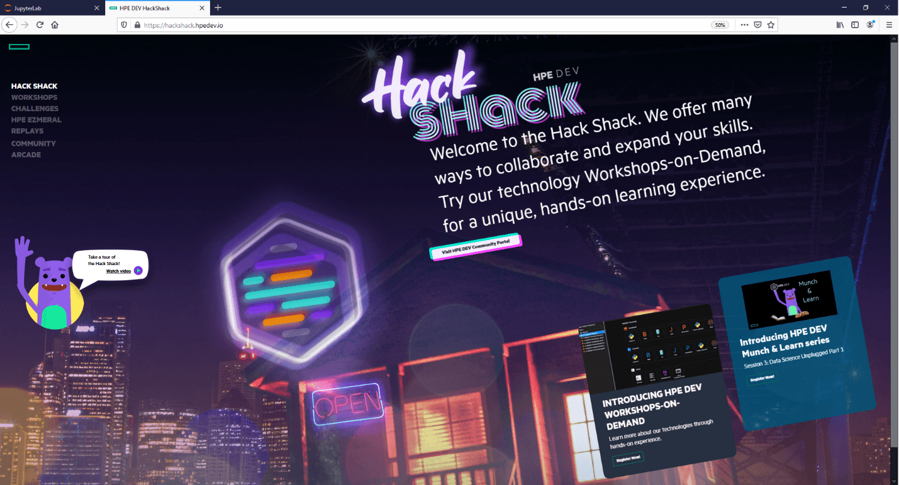
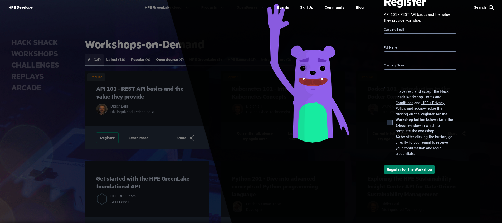

After the physical restrictions placed on us by the COVID-19 pandemic, everyone appears to be finding new ways to connect and learn.

It is in this spirit that the HPE DEV team is making their highly popular Jupyter Notebook-based workshops available for free, under the Apache v2 Open Source license, now available at [github.com](https://github.com/Workshops-on-Demand). These on-demand workshops, which premiered at the HPE Discover Virtual Event, have met with rave reviews worldwide. They provide developers, data scientists, and IT professionals the opportunity to get more hands-on experience working with various technologies.

These on-demand workshops offer students an understanding of specific technologies through a hands-on experience and detailed instructions provided in a Jupyter Notebook format. Read on to understand the details of this Workshops-on-Demand (WoD) program.

Students will generally have between 2 and 4 hours to go through the course, which includes time to review the video replay (if available), follow the Jupyter Notebook instructions, and save their work to their local laptop should they want to do more work in their own environment or retake the workshop.

Our goal is to provide both a platform that any structure can deploy onsite or in the cloud to support knowledge tranfer for their practitioners, as well as pre-existing content (which the HP DEV team also open sourced) on Open Source technologies. Those interested by the deplyment and architecture should read the [dedicated document](DOCUMENTATION.md).

In the rest of this user's guide, we will use the existing HPE DEV Hackshack platform to explain how things works. The only difference between the Open Source platform and HPE's one is the portal, more rich for HPE, providing blog articles, technical documentation, ... OK Time to start !

## How it works

Those who wish to enroll in the workshop should go to the [Hack Shack Workshop page](https://developer.hpe.com/hackshack/workshops/). From there, select which on-demand workshop you want to take and click on the **Register** button:

At this point, the registration panel pops up. 
Enter the details requested and click on the **Take the Workshop** button. In a matter of just a few minutes, you’ll start your workshop.

By pressing the **Register for the Workshop button**, you initiate a back-end automated registration process. This process spawns a dedicated notebook environment for you and sends you a welcome email indicating that you have been registered in the database.

Not long after, it sends you a second email providing a link to your workshop, along with your StudentID and password.

> **IMPORTANT: Receipt of this email indicates that the workshop environment is ready for you to begin. You will have just 4 hours from the receipt of this second email to complete the workshop. It is recommended that you only register for a workshop when you know you will have the next 4 hours to work on it. We advise you to regularly save your work and download the Jupyter Notebook to refer to later should you not be able to finish the course within the given 4-hour time slot. If you cannot finish the workshop in that time, you will need to run the course again from the beginning.**

## The Jupyter Notebook-based workshops

A Jupyter Notebook is an open-source web application that allows you to create and share documents that contain live code, equations, visualizations and narrative text. The Jupyter Project was an important step forward for sharing and interactive development.  [Project Jupyter’s](https://jupyter.org/index.html) [JupyterHub](https://jupyterhub.readthedocs.io/en/stable/) was created to support many users. The Hub can offer notebook servers to an entire class of students, a corporate data science workgroup, a scientific research project team, or a high-performance computing group. With [JupyterHub](https://github.com/jupyterhub/jupyterhub), you can create a multi-user Hub that spawns, manages, and proxies multiple instances of the single-user [Jupyter Notebook](https://mybinder.org/v2/gh/ipython/ipython-in-depth/master?filepath=binder/Index.ipynb) server.

As explained in Fred Passeron’s earlier post, [Jupyter saved my day](/blog/jupyter-saved-my-day), for our on-demand workshops the notebooks contain simple Python or Powershell pieces of codes to interact with the different APIs available in the HPE portfolio. All instructions are provided in a markdown format. We centralize the different notebooks on a single JupyterHub server. 

When you click on the **Start Workshop** button found in your second email, it will bring you to a **Sign In** page where you will log into the workshop with your StudentID and the password provided in your second email.

Once you log in, open the workshop folder on the left by double-clicking on it. 

Each notebook generally has several sections. Start with the **Read Me First** and follow the instructions from there.

## Don’t forget to save your work 

One hour prior to the end of the 4-hour period, you will receive an email reminding you that your session is coming to a close and that you should download the workshop notebook if you anticipate using it in the future. At the end of every session, the environment is cleaned up automatically, so be sure to save your work.

At the end of the workshop, you will receive a final email indicating that the workshop is over. In the email, you will also be asked to take a short survey. The results of this survey will help us improve how we offer the workshops-on-demand in the future. Your feedback is very important to our being able to meet your needs, so we encourage you to take just a few minutes to fill it out.

## How to get help

To receive SME assistance through our [workshop Slack channel](https://hpedev.slack.com/archives/C01B60X8SSD), make sure you join the [workspace](https://slack.hpedev.io/). We staff the channel to answer questions between 4 am and 4 pm EST Monday through Friday. You may wish to ensure you schedule the timing of your course between those hours if you think you’ll have questions or need additional help.

There will be a limited number of seats available. These seats will be filled on a first-come/first-serve basis. We look forward to the opportunity of offering these workshops to you. Remember to [check the Hack Shack workshops library](/hackshack/workshops) regularly for any further updates.
