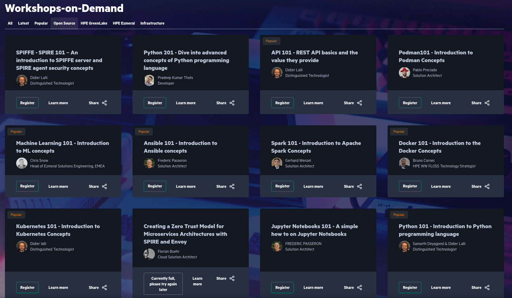

# Workshops-on-Demand architecture

What is the goal of the Workshops-on-Demand (WoD) ? Make it easy to register for and run jupyter notebooks you can host yourself thanks to this infrastructure.


The WoD infrastructure comprises 3 differents systems to work, that are usually spread across 3 machines:
 
* a wod-backend machine, hosting the Jupyter Hub and the WoD templates to generate the real workshop that a given student will run, witth eir metadata. This machine may also intercat with appliances for WoD neededd one, such as Docker e.g. You may have multiple wod-backend in case of a large setup. Corresponding software on the repos [wod-backend](https://github.com/Workshops-on-Demand/wod-backend), [wod-notebooks templates](https://github.com/Workshops-on-Demand/wod-notebooks), [wod-private optional setup](https://github.com/Workshops-on-Demand/wod-private)
* a wod-api-db machine hosting the WoD API service and a PostgreSQL database to store live information about the running platform. Corresponding software on the repo [wod-api-db](https://github.com/Workshops-on-Demand/wod-api-db)
* a wod-fronted machine, hosting the Web interface to see the list of available workshops and book one. Corresponding software on the repo [wod-frontend](https://github.com/Workshops-on-Demand/wod-frontend)

It is built on shoulders of giants


The WoD architecture uses REST and MAIL API to allow communication between its nodes


Before a note book is made available to the user requesting it, there are a certain number of communications happening between machines


# Workshops-on-Demand documentation

Here are a series of blogs published on the [HPE Developer Community Portal](https://developer.hpe.com/blog) describing the genesis and the architecture of the project. It also covers the deloyment phase of the different components as well as the creation of content.

* 0/ [From Jupyter Notebooks-as-a-Service to HPE DEV Workshops-on-Demand](https://developer.hpe.com/blog/from-jupyter-notebooks-as-a-service-to-hpe-dev-workshops-on-demand/)
* 1/ [Open sourcing Workshops-on-Demand part 1: Why and How](https://developer.hpe.com/blog/willing-to-build-up-your-own-workshops-on-demand-infrastructure/)
* 2/ [Open Sourcing Workshops-on-Demand part 2: How to Deploy the backend](https://developer.hpe.com/blog/open-sourcing-workshops-on-demand-part2-deploying-the-backend/)
* 3/ [Open Sourcing Workshops-on-Demand part 3: Understand the Backend](https://developer.hpe.com/blog/open-sourcing-workshops-on-demand-part3-understanding-the-backend/)
* 4/ [Open Sourcing Workshops-on-Demand part 4: Manage the Backend](https://developer.hpe.com/blog/open-sourcing-workshops-on-demand-part4-managing-the-backend/)
* 5/ Open Sourcing Workshops-on-Demand part 5: How to Deploy the frontend and API servers (To be Published)
* 6/ Open Sourcing Workshops-on-Demand part 6: Create new workshops (To be Published)

You can also refer to the various presentations made on this project:
* [LCA 2021](https://www.youtube.com/watch?v=D6Ss3T2p008)
* [OSXP 2021](https://www.slideshare.net/HuinLucile/api-rest-procmail-la-rescousse)
* [JDLL 2024](https://pretalx.jdll.org/jdll2024/talk/VUEQFM/)
* [AlpOSS 2024](https://alposs.fr/2024/presentations/03%20-%20HPE%20-%20Bruno%20Cornec.pdf)

# Installing a WoD infrastructure

In order to install a full infrastructure, a set of reliminary steps are required:

* Install a VM/Physical machine with [Ubuntu 24.04 LTS](https://www.ubuntu-fr.org/download/) minimal and default setup. (20.04 or 22.04 should still work, while less tested these days).
* On each VM the user ubuntu is being created and can be used for the initial setup. For access to the machine and account refer to the [Ubuntu documentation](https://ubuntu.com/server/docs/basic-installation) or how a VM template was set up. Ensure that this user as root access (either via sudo or with password access)
* Then you have to ensure minimal dependencies are present to run the installation. We only need git. All other dependencies are installed by the installer. So issue on each machine: `sudo apt install git`
* Once installed you can use it to clone the installer (part of the [install project](https://github.com/Workshops-on-Demand/wod-install)) again on each machine: `git clone https://github.com/Workshops-on-Demand/wod-install`
* Then you use the installer to install your WoD infrastructure: `cd wod-install/install ; ./install.sh -h`
* [Reading the example](https://github.com/Workshops-on-Demand/wod-install/blob/main/install/install.sh#L89) for the full infrastructure at the end of the help message should give you the required guidance to set it up.

At the time of this writing, this reads:
```
Full installation example of a stack with:
- 2 backend servers be1 and be2 using port 8010
- 1 api-db server apidb on port 10000
- 1 frontend server front on port 8000
- all declared on the .local network
- internal postfix server running on port 9000
- e-mail sender being wodmailer@local
- ansible groupname being test
- management user being wodmgr
 
On the be1 machine:
  sudo ./install.sh -a apidb.local:10000 -f front.local:8000 \
  -g test -u wodmgr -p 9000 -s wodmailer@local\
  -b be1.local:8010 -n 1 -t backend \
On the be2 machine:
  sudo ./install.sh -a apidb.local:10000 -f front.local:8000 \
  -g test -u wodmgr -p 9000 -s wodmailer@local\
  -b be2.local:8010 -n 2 -t backend \
On the apidb machine:
  sudo ./install.sh -a apidb.local:10000 -f front.local:8000 \
  -g test -u wodmgr -p 9000 -s wodmailer@local\
  -b be1.local:8010,be2.local:8010 -t api-db \
On the frontend machine:
  sudo ./install.sh -a apidb.local:10000 -f front.local:8000 \
  -g test -u wodmgr -p 9000 -s wodmailer@local\
  -t frontend \
```

Note that the installer should support Rocky/Alma or Debian fairly easily instead of Ubuntu, but tests have not been fully performed. Contributions welcome.
