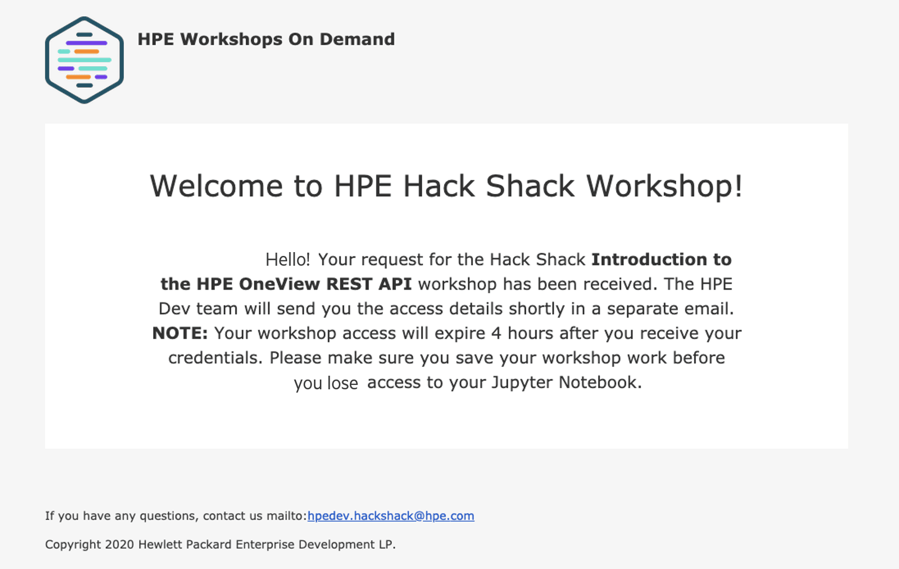

After the physical restrictions placed on us by the COVID-19 pandemic, everyone appears to be finding new ways to connect and learn.

It is in this spirit that the HPE DEV team is making their highly popular Jupyter Notebook-based workshops available for free, under the Apache v2 Open Source license, now available at [github.com](https://github.com/Workshops-on-Demand). These on-demand workshops, which premiered at the HPE Discover Virtual Event, have met with rave reviews worldwide. They provide developers, data scientists, and IT professionals the opportunity to get more hands-on experience working with various technologies.

These on-demand workshops offer students an understanding of specific technologies through a hands-on experience and detailed instructions provided in a Jupyter Notebook format. Read on to understand the details of this Workshops-on-Demand (WoD) program.

Students will generally have between 2 and 4 hours to go through the course, which includes time to review the video replay (if available), follow the Jupyter Notebook instructions, and save their work to their local laptop should they want to do more work in their own environment or retake the workshop.

Our goal is to provide both a platform that any structure can deploy onsite or in the cloud to support knowledge transfer for their practitioners, as well as pre-existing content (which the HP DEV team also open sourced) on Open Source technologies. Those interested by the deployment and architecture of the platform should read the [dedicated document](ADMIN-GUIDE.md).

In the rest of this user's guide, we will use the existing HPE DEV Hackshack platform to explain how things works. The only difference between the Open Source platform and HPE's one is the portal, richer for HPE, providing blog articles, technical documentation, ... OK Time to start !

## How it works

Those who wish to enroll in the workshop should go to the [Hack Shack Workshop page](https://developer.hpe.com/hackshack/workshops/). From there, select which on-demand workshop you want to take and click on the **Register** button:

At this point, the registration panel pops up. 
Enter the details requested and click on the **Register for the Workshop** button. In a matter of just a few minutes, you’ll start your workshop.

By pressing the **Register for the Workshop button**, you initiate a back-end automated registration process. This process spawns a dedicated notebook environment for you and sends you a welcome email indicating that you have been registered in the database.

Not long after, it sends you a second email providing a link to your workshop, along with your StudentID and password.

> **IMPORTANT: Receipt of this email indicates that the workshop environment is ready for you to begin. You will have just 4 hours from the receipt of this second email to complete the workshop. It is recommended that you only register for a workshop when you know you will have the next 4 hours to work on it. We advise you to regularly save your work and download the Jupyter Notebook to refer to later should you not be able to finish the course within the given 4-hour time slot. If you cannot finish the workshop in that time, you will need to run the course again from the beginning.**

## The Jupyter Notebook-based workshops

To give you a bit of background: The [Jupyter project](https://jupyter.org/index.html) (for Julia / Python / R) is the result of a project called [IPython](https://en.wikipedia.org/wiki/IPython), which is an advanced Python interpreter, that improves the productivity of your code in Python. IPython has gradually evolved, notably with the creation of Notebooks, and now offers a web interface in JSON format that allows you to run initialy a Python kernel and to code directly in a browser with a display of intermediate results. The Jupyter Project was an important step forward for sharing and "interactive" development. [Project Jupyter’s](https://jupyter.org/index.html) [JupyterHub](https://jupyterhub.readthedocs.io/en/stable/) was created to support many users. The Hub can offer notebook servers to an entire class of students, a corporate data science workgroup, a scientific research project team, or a high-performance computing group. With [JupyterHub,](https://github.com/jupyterhub/jupyterhub) you can create a multi-user Hub that spawns, manages, and proxies multiple instances of the single-user [Jupyter Notebook](https://mybinder.org/v2/gh/ipython/ipython-in-depth/master?filepath=binder/Index.ipynb) server.

## What is a Jupyter Notebook?

To put it simply, a Jupyter Notebook is an open-source web application that allows you to create and share documents that contain live code, equations, visualizations and narrative text. Uses include data cleaning and transformation, numerical simulation, statistical modeling, data visualization, machine learning, and much more. In our case, Notebooks contain simple Python or shell or other pieces of codes to interact with the different APIs available studied in the Notebook. Instructions are provided in a [markdown](https://en.wikipedia.org/wiki/Markdown) format. We centralize the different notebooks on a single [JupyterHub](https://jupyterhub.readthedocs.io/en/stable/) server. This allows us to replicate them across the multiple students currently configured on the server fairly easily through [Ansible](https://en.wikipedia.org/wiki/Ansible_(software)) playbooks. When changes are necessary (fixing a typo for instance in a notebook), updates can be performed quickly by just launching the playbook.

From a course standpoint, the notebook format is a really simple and flexible solution. Students can even download the notebooks and run them locally on their laptops if they want to do them again later on or reuse some of the code for their own projects. It's also a convenient way of maintaining existing Notebooks for producers, and the simple Markdown format makes it appealing for new contributors to add to the collection of Notebooks.

## Running the Workshop on Demand

When you click on the **Start Workshop** button found in your second email, it will bring you to a **Sign In** page where you will log into the workshop with your StudentID and the password provided in your second email.

Once you log in, open the workshop folder on the left by double-clicking on it. 

Each notebook generally has several sections ordered by the initial number. Start with the **Read Me First** and follow the instructions from there.

## Don’t forget to save your work 

One hour prior to the end of the 4-hour period, you will receive an email reminding you that your session is coming to a close and that you should download the workshop notebook if you anticipate using it in the future. At the end of every session, the environment is cleaned up automatically, so be sure to save your work.

At the end of the workshop, you will receive a final email indicating that the workshop is over. In the email, you will also be asked to take a short survey. The results of this survey will help us improve how we offer the workshops-on-demand in the future. Your feedback is very important to our being able to meet your needs, so we encourage you to take just a few minutes to fill it out.

